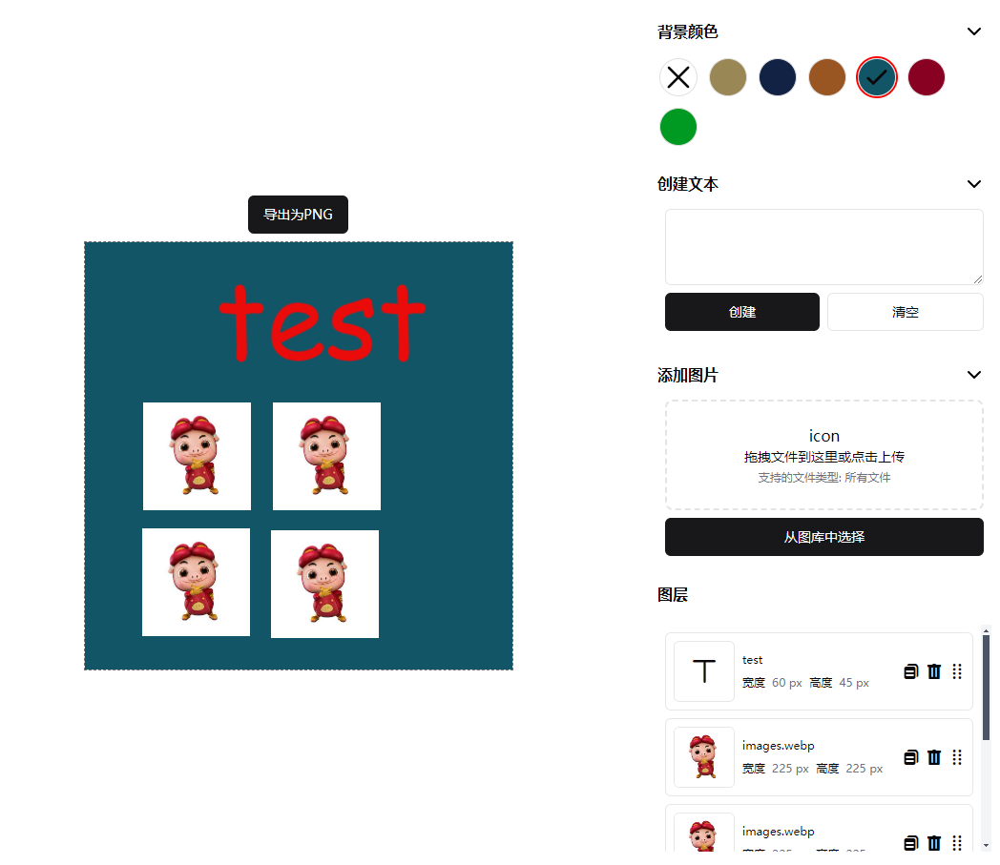

# Fabric.js 实现的 designer demo

用于学习 fabric.js 的用法

- 文本图层实现了 字体、颜色、角度、对齐方式
- 图层列表实现了 翻转、缩放、角度、对齐方式
- 支持复制图层
- 拖拽图层可以调整图层层级顺序
- 利用 indexedDB 进行本地存储 实现了简易图库功能
- 导出 canvas 为图片
- bug 还挺多的...... 有空再完善( •̀ ω •́ )✧

[**在线预览**](https://designer.fanjs.cn/)

## 效果图



## 技术栈

- [vue3](https://vuejs.org/)
- [typeScript](https://www.typescriptlang.org/)
- [tailwindcss](https://tailwindcss.com/)
- [pinia](https://pinia.vuejs.org/)
- [vite](https://vitejs.dev/)
- [fabric.js](http://fabricjs.com/)
- [shadcn-vue](https://www.shadcn-vue.com/)

## 如何运行

确保您的开发环境中已安装 Node.js（我使用的是 v20.11.0）

```bash
git clone https://github.com/Fanvvv/fabric-demo.git

cd fabric-demo

npm i

npm run dev
```

在浏览器中打开 `http://localhost:5173/` 即可看到效果
